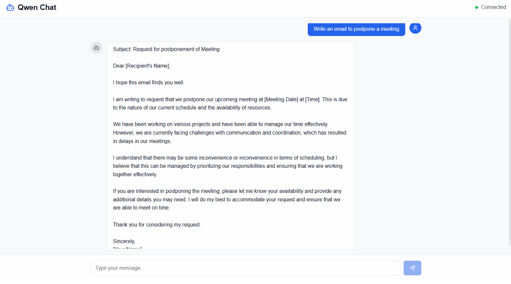
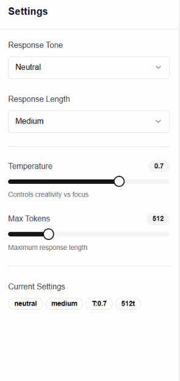

# <div align="center">Qwen Chat — Self-Hosted LLM Chat Interface powered by vLLM</div>

A sleek, real-time chat application that talks to a **self-hosted Large Language Model** served with [vLLM](https://github.com/vllm-project/vllm). The frontend is a modern Next.js app that streams responses token-by-token from a locally running **Qwen2.5-Coder** model exposed through an OpenAI-compatible API — no external AI provider, no API keys, everything running on your own machine.

> 🎓 **This was a learning project** — built to explore how to self-host an open-source LLM with vLLM, expose it through an OpenAI-compatible endpoint, and wire it up to a streaming chat UI using the Vercel AI SDK.

## Built with the tools and technologies:

           

## Model served: Qwen2.5-Coder-0.5B-Instruct – ([Hugging Face](https://huggingface.co/Qwen/Qwen2.5-Coder-0.5B-Instruct))



## Features

- **Self-Hosted Inference**: Runs an open-source LLM entirely on your own hardware via vLLM — no third-party AI provider required
- **Real-Time Token Streaming**: Responses stream in live, word-by-word, using the Vercel AI SDK's `streamText`
- **Adjustable Response Tone**: Switch between Professional, Casual, Friendly, Formal, Neutral, and Creative personas on the fly
- **Configurable Response Length**: Choose Short, Medium, Long, or Very Detailed answers
- **Temperature Control**: A live slider (0.0 – 1.0) to balance focused vs. creative output
- **Max Tokens Control**: Cap response length anywhere from 50 to 2048 tokens
- **OpenAI-Compatible Backend**: vLLM exposes a drop-in `/v1/chat/completions` endpoint, so any OpenAI client just works
- **Fully Responsive UI**: Collapsible settings sidebar, mobile-friendly layout, and a clean chat experience
- **Dockerized Model Server**: The vLLM server ships as a container that runs the model in CPU mode out of the box



## How It Works

The application is split into two independent pieces that communicate over an OpenAI-compatible HTTP API:

```
┌─────────────────────┐      POST /api/chat      ┌──────────────────────┐   POST /v1/chat/completions   ┌────────────────────────┐
│   Browser (React)   │ ───────────────────────▶ │  Next.js API Route   │ ────────────────────────────▶ │   vLLM Server (Qwen)   │
│  useChat() + UI     │ ◀─────────────────────── │  streamText proxy    │ ◀──────────────────────────── │  localhost:8000/v1     │
└─────────────────────┘     streamed tokens      └──────────────────────┘        streamed tokens        └────────────────────────┘
```

1. The React frontend collects the user's message plus generation settings (tone, length, temperature, max tokens).
2. The Next.js API route builds a dynamic **system prompt** from those settings and forwards the request to the local vLLM server.
3. vLLM runs inference on **Qwen2.5-Coder-0.5B-Instruct** and streams tokens back through the route to the browser in real time.

## Tech Stack

- **Frontend**: Next.js 15, React 18, TypeScript
- **Styling**: Tailwind CSS, Radix UI primitives, shadcn/ui components
- **AI Layer**: Vercel AI SDK (`ai`, `@ai-sdk/openai`) for streaming
- **Model Server**: vLLM serving Qwen2.5-Coder-0.5B-Instruct
- **API Protocol**: OpenAI-compatible Chat Completions
- **Icons**: Lucide React
- **Containerization**: Docker (CPU-mode inference)

## Key Code Snippet — Connecting to the Self-Hosted Model

The magic is that vLLM speaks the OpenAI protocol, so the frontend points a standard OpenAI client at `localhost:8000` and streams straight from the local model:

```typescript
import { createOpenAI } from "@ai-sdk/openai";
import { streamText } from "ai";

// Point a standard OpenAI client at the local vLLM server
const openai = createOpenAI({
  apiKey: "123", // vLLM doesn't require a real API key
  baseURL: "http://localhost:8000/v1",
});

export async function POST(req: Request) {
  const { messages, tone, length, temperature, maxTokens } = await req.json();

  // Build a dynamic system prompt from the user's chosen settings
  const systemMessage = createSystemMessage(tone, length);

  // Stream tokens straight from the self-hosted Qwen model
  const result = streamText({
    model: openai("qwen-chat"),
    messages: [{ role: "system", content: systemMessage }, ...messages],
    temperature: temperature || 0.7,
    maxTokens: maxTokens || 512,
  });

  return result.toDataStreamResponse();
}
```

The system prompt itself is composed on the fly, translating the UI controls into natural-language instructions for the model:

```typescript
function createSystemMessage(tone: string, length: string): string {
  let systemPrompt = "You are a helpful AI assistant.";

  switch (tone) {
    case "professional":
      systemPrompt +=
        " Respond in a professional, business-appropriate manner.";
      break;
    case "creative":
      systemPrompt +=
        " Respond creatively with engaging and imaginative language.";
      break;
    // ...casual, friendly, formal, neutral
  }

  switch (length) {
    case "short":
      systemPrompt += " Keep your responses concise and to the point.";
      break;
    case "detailed":
      systemPrompt +=
        " Provide very thorough, detailed explanations with examples.";
      break;
    // ...medium, long
  }

  return systemPrompt;
}
```

## The vLLM Model Server (Dockerized)

The backend is a single container that installs vLLM and serves the Qwen model with an OpenAI-compatible API in CPU mode:

```dockerfile
FROM python:3.10-slim

RUN apt-get update && apt-get install -y python3-pip git && rm -rf /var/lib/apt/lists/*
RUN pip install --upgrade pip && pip install vllm

EXPOSE 8000
ENV PORT=8000

# Serve Qwen with an OpenAI-compatible endpoint, running on CPU
CMD ["sh", "-c", "vllm serve Qwen/Qwen2.5-Coder-0.5B-Instruct \
     --trust-remote-code --served-model-name qwen-chat --device cpu --port $PORT"]
```

## API Endpoints

### Next.js API Route

- `POST /api/chat` — Accepts the chat history and generation settings (`tone`, `length`, `temperature`, `maxTokens`), then proxies and streams the response from vLLM

### vLLM Server (OpenAI-Compatible)

- `POST /v1/chat/completions` — Standard OpenAI chat completions endpoint (served at `localhost:8000`)
- `GET /v1/models` — Lists the available served model (`qwen-chat`)

## Generation Parameters

The UI exposes four live controls that shape every response:

| Parameter       | Options / Range                                           | Effect                                   |
| --------------- | --------------------------------------------------------- | ---------------------------------------- |
| **Tone**        | Professional, Casual, Friendly, Formal, Neutral, Creative | Injects a persona into the system prompt |
| **Length**      | Short, Medium, Long, Very Detailed                        | Guides how verbose the model should be   |
| **Temperature** | `0.0` – `1.0` (step `0.1`)                                | Balances focused vs. creative sampling   |
| **Max Tokens**  | `50` – `2048` (step `50`)                                 | Hard cap on the response length          |

## Project Structure

```
vLLM_project/
├── app/
│   ├── api/chat/route.ts     # Streaming proxy to the vLLM server
│   ├── page.tsx              # Chat UI + settings sidebar
│   ├── layout.tsx
│   └── globals.css
├── components/ui/            # shadcn/ui + Radix components
├── hooks/
├── lib/utils.ts
├── Dockerfile                # vLLM model server (CPU mode)
└── [config files]
```

## Getting Started

> Minimal setup — two processes: the model server and the web app.

**1. Start the vLLM model server** (via Docker):

```bash
docker build -t qwen-vllm .
docker run -p 8000:8000 qwen-vllm
```

**2. Run the Next.js app** (in a separate terminal):

```bash
npm install
npm run dev
```

Open [http://localhost:3000](http://localhost:3000) and start chatting.

---

<div align="center"><sub>Built as a learning project to explore self-hosted LLM inference with vLLM. 🚀</sub></div>
